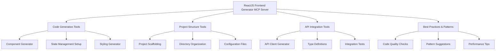
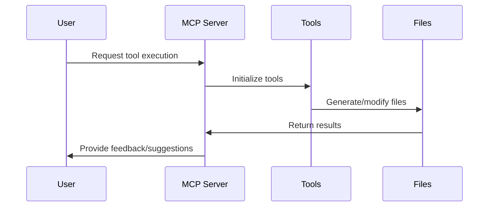

# ReactJS Frontend Generator MCP Server Plan

## Overview

This MCP server will provide tools for generating and managing a modern React frontend application that integrates with OpenManus Python backend. The server will always use the latest stable versions of all dependencies:

- React 18+
- Tailwind CSS 3+
- TypeScript 5+
- Vite (for build tooling)
- React Router 6+
- React Query/TanStack Query (for API integration)
- Redux Toolkit (optional state management)
- Jest & React Testing Library
- ESLint & Prettier

## Architecture



## Implementation Flow



## Core Tools

### 1. Component Generator Tool

```typescript
interface ComponentConfig {
  name: string;
  props?: PropDefinition[];
  styleType: "tailwind" | "css-modules" | "material-ui";
  stateManagement?: "local" | "context" | "redux";
  features?: string[];
  typescript: boolean;
}
```

### 2. Project Structure Tool

```typescript
interface ProjectConfig {
  name: string;
  stateManagement: "redux-toolkit" | "context" | "none";
  styling: "tailwind" | "css-modules" | "material-ui";
  routing: boolean;
  testing: true; // Always included
  packageManager: "npm" | "pnpm" | "yarn";
  versionControl: boolean;
}
```

### 3. API Integration Tool

```typescript
interface APIConfig {
  endpoints: EndpointDefinition[];
  baseURL: string;
  authentication?: AuthConfig;
  errorHandling: boolean;
  queryClient: boolean; // For React Query setup
}
```

## Directory Structure

```
react-frontend-mcp/
├── src/
│   ├── index.ts              # Main MCP server entry
│   ├── tools/
│   │   ├── component.ts      # Component generation
│   │   ├── project.ts        # Project structure
│   │   ├── api.ts           # API integration
│   │   └── patterns.ts      # Best practices
│   ├── templates/
│   │   ├── components/      # Component templates
│   │   ├── config/          # Configuration templates
│   │   └── api/            # API integration templates
│   └── utils/
│       ├── parser.ts        # Code parsing utilities
│       └── generator.ts     # Code generation utilities
├── package.json
└── tsconfig.json
```

## MCP Server Configuration

The server will be configured in the MCP settings file with:

```json
{
  "mcpServers": {
    "react-frontend": {
      "command": "node",
      "args": ["path/to/react-frontend-mcp/build/index.js"],
      "env": {
        "NODE_ENV": "production"
      }
    }
  }
}
```

## Implementation Steps

1. Create the MCP server project structure
2. Implement the core tools:
   - Component generator
   - Project scaffolding
   - API integration
3. Add templates for various patterns and components
4. Implement best practices engine
5. Add documentation and examples
6. Set up testing and validation

## Best Practices Engine

The server will enforce and suggest:

1. Performance best practices:
   - Code splitting
   - Lazy loading
   - Memoization
2. Security considerations:
   - XSS prevention
   - CSRF protection
   - Secure API calls
3. Accessibility:
   - ARIA attributes
   - Keyboard navigation
   - Screen reader support
4. Code quality:
   - ESLint rules
   - TypeScript strict mode
   - Testing coverage

## Next Steps

1. Set up the MCP server project
2. Implement core functionality
3. Add templates and patterns
4. Test and validate
5. Deploy and integrate with OpenManus
